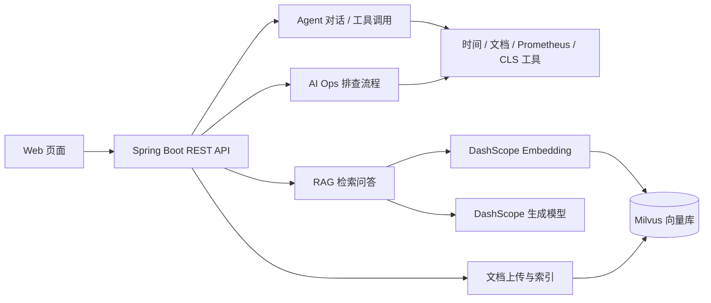

# Oncall Agent

一个基于 Spring Boot、Spring AI Alibaba、DashScope 与 Milvus 构建的值班运维辅助 Agent 示例。项目将大模型对话、工具调用、知识库检索和告警排查流程组合在一起，并提供一个由 Spring Boot 托管的简单 Web 页面。

> 这是用于学习与演示的项目，不应直接视为生产级 On-call 平台。接入真实监控、日志或运维系统前，请完成权限控制、数据脱敏、审计、限流和故障隔离等工作。

## 功能

- **Agent 对话**：使用 Spring AI Alibaba Agent 框架构建 ReAct 对话，并允许模型调用已注册工具。
- **RAG 知识库问答**：导入 Markdown / TXT 文档，切分文本、生成向量并写入 Milvus；查询时召回相关片段供模型参考。
- **告警与日志工具**：包含时间、内部文档检索、Prometheus 指标和 CLS 日志相关工具；Prometheus / CLS 默认启用 Mock 数据。
- **AI Ops 流程**：基于 Planner、Executor、Supervisor 等协作步骤尝试整理告警排查过程。
- **SSE 流式输出**：聊天、RAG 和 AI Ops 接口支持服务端事件流。
- **文件上传与索引**：支持 TXT、MD 上传；上传后会尝试建立向量索引。
- **健康检查**：提供 Milvus 连通性检查接口。

## 技术栈

| 组件 | 版本 / 默认配置 |
|---|---|
| Java | 17 |
| Spring Boot | 3.5.15 |
| Spring AI | 1.1.0 |
| Spring AI Alibaba | 1.1.0.0-RC2 |
| DashScope Java SDK | 2.17.0 |
| Milvus Java SDK | 2.6.10 |
| Milvus | `localhost:19530`，database `default`，collection `biz` |
| Embedding 模型 | `qwen3.7-text-embedding-flash` |
| RAG 生成模型 | `qwen3-30b-a3b-thinking-2507` |

版本信息取自项目当前 `pom.xml` 与 `application.yml`。模型可用性及 API 权限取决于 DashScope 账户配置。

## 架构概览



### 文档索引与检索

上传接口接受 TXT、MD 文件，默认保存到 `./uploads`。索引服务会按 Markdown 标题和段落切分，默认块大小为 800 个字符、重叠 100 个字符，再调用 DashScope 生成向量并写入 Milvus。检索默认 Top-K 为 3；collection 的向量维度为 1024，距离度量使用 L2。更换 Embedding 模型时，应确认维度、索引配置兼容，并评估是否需要重建已有向量。

## 项目结构

```text
src/main/java/com/leixs/agent/
├── client/       # Milvus 客户端
├── config/       # Spring 与业务配置
├── constant/     # Milvus 等常量
├── controller/   # 聊天、RAG、上传、健康检查 API
├── dto/          # 请求及业务数据对象
├── service/      # 对话、AI Ops、向量索引与检索服务
└── tool/         # Agent 可调用的工具

src/main/resources/
├── application.yml
└── static/       # Web 页面、样式与前端脚本

src/test/         # Spring Boot 测试
```

## 运行环境

- JDK 17
- Maven 3.6+（建议使用较新的 Maven 3.x）
- 可访问的 Milvus 实例
- DashScope API Key，以及聊天和 Embedding 模型的调用权限

### 1. 配置密钥

在 Git Bash 当前会话中设置 API Key：

```bash
export DASHSCOPE_API_KEY="替换为你自己的 DashScope API Key"
```

请勿把真实密钥写入源码、配置文件、README、截图或 Git 提交。启动前还应确认项目配置没有任何可公开的密钥回退值；仅设置环境变量并不能抵消配置文件中已存在的回退密钥风险。

### 2. 准备 Milvus

启动一个本机或远程 Milvus 服务，并根据实际情况修改 `src/main/resources/application.yml` 中的连接设置。默认值为：

| 配置 | 默认值 |
|---|---|
| `milvus.host` | `localhost` |
| `milvus.port` | `19530` |
| `milvus.database` | `default` |
| `file.upload.path` | `./uploads` |

向量 collection 名称为 `biz`，维度常量定义在 `MilvusConstants` 中。

### 3. 启动应用

在项目根目录运行：

```bash
mvn spring-boot:run -Dspring-boot.run.main-class=com.leixs.agent.OncallAgentApplication
```

默认端口是 `9901`。启动后可访问：

- Web 页面：<http://localhost:9901/>
- Milvus 健康检查：<http://localhost:9901/milvus/health>

#### 当前打包配置注意事项

目前 `pom.xml` 中 Spring Boot Maven Plugin 配置的 `mainClass` 是 `org.example.Main`，而源码启动类为 `com.leixs.agent.OncallAgentApplication`。上面的运行命令显式指定了源码启动类。若要构建可执行 JAR，请先将 POM 中的 `mainClass` 改为实际启动类，再构建并验证 JAR 能正常启动。当前环境未验证项目构建结果。

## 配置项

| 配置项 | 默认值 | 说明 |
|---|---:|---|
| `server.port` | `9901` | HTTP 端口 |
| `milvus.host` | `localhost` | Milvus 主机 |
| `milvus.port` | `19530` | Milvus 端口 |
| `milvus.database` | `default` | Milvus database |
| `document.chunk.max-size` | `800` | 文档分块最大字符数 |
| `document.chunk.overlap` | `100` | 分块重叠字符数 |
| `file.upload.path` | `./uploads` | 上传目录 |
| `file.upload.allowed-extensions` | `txt,md` | 允许的文件扩展名 |
| `rag.top-k` | `3` | 向量检索返回片段数 |
| `dashscope.embedding.model` | `qwen3.7-text-embedding-flash` | Embedding 模型 |
| `rag.model` | `qwen3-30b-a3b-thinking-2507` | RAG 生成模型 |
| `prometheus.mock-enabled` | `true` | 是否返回 Prometheus 模拟数据 |
| `cls.mock-enabled` | `true` | 是否返回 CLS 模拟日志 |

## HTTP API

默认基础地址：`http://localhost:9901`。聊天类接口请求字段为 `Id` 和 `Question`（代码同时接受小写别名 `id`、`question`）。

| 方法 | 路径 | 说明 |
|---|---|---|
| `POST` | `/api/chat` | 普通 Agent 对话，JSON 响应 |
| `POST` | `/api/chat_stream` | Agent 流式对话，SSE |
| `POST` | `/api/rag_stream` | RAG 知识库流式问答，SSE |
| `POST` | `/api/ai_ops` | AI Ops 排查流式输出，SSE |
| `POST` | `/api/upload` | 上传并尝试索引文件，multipart 字段 `file` |
| `POST` | `/api/chat/clear` | 清空指定会话历史 |
| `GET` | `/api/chat/session/{sessionId}` | 查询会话信息 |
| `GET` | `/milvus/health` | 检查 Milvus 连通性 |

### 普通对话

```bash
curl -X POST 'http://localhost:9901/api/chat' \
  -H 'Content-Type: application/json' \
  -d '{"Id":"demo-session","Question":"如何排查接口响应变慢？"}'
```

普通响应使用统一包装结构，业务数据位于 `data` 字段；成功的聊天回答位于 `data.answer`。

### RAG 流式问答

```bash
curl -N -X POST 'http://localhost:9901/api/rag_stream' \
  -H 'Content-Type: application/json' \
  -H 'Accept: text/event-stream' \
  -d '{"Id":"demo-session","Question":"知识库中关于服务发布的流程是什么？"}'
```

SSE 事件的 `data` 为 JSON 消息，消息类型包括内容、错误和完成状态。具体事件字段以 Controller 实现为准。

### 上传文档

```bash
curl -X POST 'http://localhost:9901/api/upload' \
  -F 'file=@./docs/runbook.md'
```

上传成功与索引成功并非同一件事；若索引失败，接口会返回服务不可用状态及提示信息。不要上传包含凭据、个人信息或未授权内部数据的文档。

### Milvus 健康检查

```bash
curl 'http://localhost:9901/milvus/health'
```

## 测试与限制

运行测试：

```bash
mvn test
```

测试类使用 `@SpringBootTest` 启动 Spring 上下文，可能受到 DashScope、Milvus 或其他外部配置影响。请在目标环境实际运行并检查结果；README 中的命令不代表项目已在所有环境验证通过。

其他已知限制：

- 会话历史和会话状态保存在应用进程内存中，重启后不会持久化；多实例部署也没有共享会话存储。
- Prometheus / CLS 当前默认使用 Mock 模式，需按实际服务配置后才可接入真实数据。
- 上传文件保存在本地目录；生产环境应增加鉴权、大小限制、文件名与路径安全校验、病毒扫描和访问控制。
- RAG 的召回与生成质量取决于文档质量、分块参数、Embedding 模型和 Milvus 索引配置。

